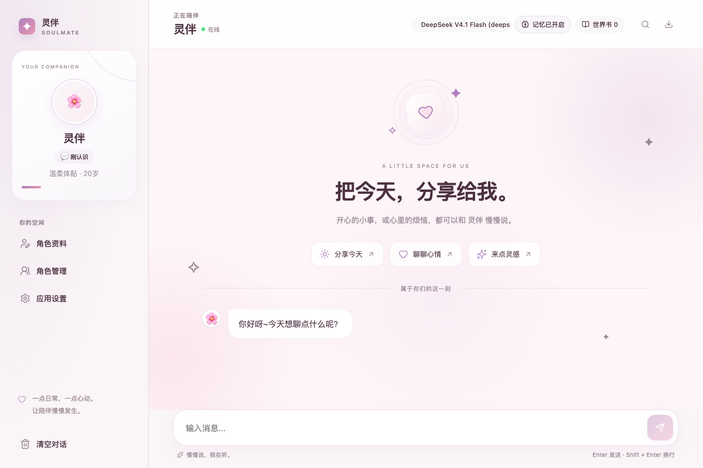

# 灵伴 SoulMate

> 把今天，分享给我。一个可以自定义角色、记住日常的 AI 陪伴桌面应用。

**陪伴对话 · 可控记忆 · 自定义角色 · 本地数据**

灵伴基于 Tauri 2、React 19 和 Rust 构建。你可以为角色设定性格、头像、说话风格和专属背景，通过流式文字对话、语音朗读、日常问候与关系阶段推进，建立属于自己的陪伴空间。应用支持云端 OpenAI 兼容接口，也可连接本机的 Ollama 和 LM Studio。

角色、聊天、记忆与设置默认保存在本机，API Key 由操作系统钥匙串保管。生成回复时，近期对话、相关记忆及角色设定会发送给你选择的模型服务，详见[隐私说明](PRIVACY.md)。

## 界面预览

新版界面采用柔和粉紫配色、轻量插画、角色卡片和缓慢背景动效。开场页提供「分享今天」「聊聊心情」「来点灵感」三个快捷话题；聊天时会收起开场页，把空间留给对话。



<details>
<summary>查看窄窗口布局（520px）</summary>


</details>

截图使用演示数据。窗口可自由调整大小，支持紧凑导航、暗夜主题、自定义配色及系统的减少动态效果偏好。

## 功能

### 对话与陪伴

- **流式回复与思考过程**：实时显示模型输出，支持中途取消、Markdown 富文本和思考过程展开。
- **保留回复候选**：重新生成时保留旧回复，可切换候选版本，并在重启后恢复选择。
- **自然的输入与阅读**：中文输入法确认候选词不会误发，支持多行消息；查看旧消息时暂停自动跟随，一键回到最新消息。
- **语音朗读**：支持自动朗读、语速、语调和声音选择，具体声音取决于操作系统。
- **日常问候与关系里程碑**：可设置问候频率和安静时段；关系推进显示基于近期互动的简短依据，阶段名称和图标可自行调整。定时问候需要应用保持运行。
- **可选知识补充**：按需检索 Wikipedia。提示词强调真实表达和不确定性，回复质量仍取决于所选模型。

### 角色与记忆

- **多角色管理**：创建、编辑、切换角色，自定义头像、名称、性格、爱好、说话风格、称呼和角色图标，各角色聊天与记忆独立保存。
- **Character Card V2**：导入、导出 JSON 角色卡，保留背景、场景、初次问候、示例对话、创作者、标签和世界书。
- **关键词世界书**：根据近期对话激活角色专属设定，支持启用开关与优先级。
- **可控长期记忆**：提取用户明确表达的资料、偏好、事件和边界；支持手动添加、固定、修正、停用和删除。
- **记忆溯源**：回复可展开查看当时参考的记忆内容。后台提取通过数据库版本检查，避免覆盖提取期间的人工修改。

### 数据与个性化

- **搜索与导出**：SQLite FTS5 搜索，短查询回退普通文本搜索；支持完整聊天 Markdown 导出。
- **备份与恢复**：完整 JSON 备份导入、导出，可选 AES-256-GCM 密码加密。明确的数据库损坏会保留原文件并重建；占用或迁移失败不会误触发重建。
- **系统钥匙串与应用锁**：API Key 不写入 SQLite；可选 4–12 位 PIN 应用锁，连续失败触发递增冷却。
- **六套主题与自定义颜色**：樱花粉、天空蓝、薄荷绿、薰衣草、暖橘、暗夜，可调整应用标志、聊天背景和气泡颜色。

## 开始使用

1. 启动应用，按首次引导填写称呼、兴趣和交流边界。
2. 选择模型服务：云端服务填写 API Key；本地服务先启动 Ollama 或 LM Studio，再点击「发现本地模型」。
3. 选择模型并测试连接，通过后进入聊天。
4. 在「角色资料」中定制角色，或从「角色管理」导入 Character Card V2；使用开场话题或输入框开始对话。
5. 在「设置 → 记忆」中调整记忆，在「设置 → 数据」中管理应用锁、备份和恢复。

后续可在「设置 → AI」切换服务与测试连接。应用不会在后台安装或启动本地模型服务。

| 服务          | 内置接口地址                                                         | 配置方式                             |
| ------------- | -------------------------------------------------------------------- | ------------------------------------ |
| Ollama        | `http://localhost:11434/v1/chat/completions`                         | 发现本机已安装模型，无需 API Key     |
| LM Studio     | `http://localhost:1234/v1/chat/completions`                          | 启动本地服务后发现模型，无需 API Key |
| DeepSeek      | `https://api.deepseek.com/v1/chat/completions`                       | API Key 与模型                       |
| OpenAI        | `https://api.openai.com/v1/chat/completions`                         | API Key 与模型                       |
| 阿里百炼 Qwen | `https://dashscope.aliyuncs.com/compatible-mode/v1/chat/completions` | API Key 与模型                       |
| 智谱 GLM      | `https://open.bigmodel.cn/api/paas/v4/chat/completions`              | API Key 与模型                       |
| Moonshot Kimi | `https://api.moonshot.cn/v1/chat/completions`                        | API Key 与模型                       |
| 硅基流动      | `https://api.siliconflow.cn/v1/chat/completions`                     | API Key 与模型                       |
| 自定义        | 手动填写 OpenAI 兼容端点                                             | 手动填写模型名称                     |

内置模型预设见 [modelProvider.ts](soulmate/src/domain/modelProvider.ts)。模型是否可用取决于服务商和账户权限，可通过连接测试检查；自定义端点需要 HTTPS，本机回环地址允许 HTTP。

### 快捷键

| 快捷键          | 操作                         |
| --------------- | ---------------------------- |
| `Enter`         | 发送消息                     |
| `Shift + Enter` | 换行                         |
| `⌘ / Ctrl + F`  | 搜索聊天                     |
| `⌘ / Ctrl + E`  | 导出聊天                     |
| `Esc`           | 关闭设置、角色管理或搜索面板 |

## 本地开发

### 前置要求

- Node.js ≥ 22.12 与 npm。
- Rust stable 工具链。
- macOS：Xcode Command Line Tools。
- 本地端到端测试使用 Google Chrome；CI 使用 Playwright Chromium。

从仓库根目录启动：

```bash
cd soulmate
npm ci
npm run tauri dev
```

开发服务器地址为 `http://localhost:1420`。桌面功能需要 Tauri 原生层；直接打开开发网页无法使用真实的数据库和钥匙串功能。

### 构建

在 `soulmate/` 目录执行：

```bash
npm run tauri build
```

macOS 安装包输出到 `soulmate/src-tauri/target/release/bundle/`。已有发布版本可在 [GitHub Releases](https://github.com/Nafixcn/soulmate/releases) 查看。

### 质量检查

从仓库根目录执行：

```bash
node scripts/check-version.mjs
cd soulmate
npm ci
npm run lint
npm run format:check
npm test
npm run test:e2e
npm run build
cd src-tauri
cargo fmt --all -- --check
cargo test
cargo clippy --all-targets -- -D warnings
```

端到端测试使用模拟数据与模型回复，不需要真实 API Key。运行前请释放 `1420` 端口，避免复用普通开发服务。

本轮改版验证（2026-10-03）：97 项前端单元测试、60 项 Rust 测试、27 项浏览器端到端测试通过；TypeScript、ESLint、Prettier、Clippy、rustfmt、版本一致性和 macOS 本机构建通过。测试通过不代表已验证所有真实模型服务与原生 WebView 行为。

## 技术架构

| 层         | 技术                                           |
| ---------- | ---------------------------------------------- |
| 桌面框架   | Tauri 2                                        |
| 前端       | React 19 + TypeScript + Vite 8                 |
| 状态与界面 | Zustand 5 + Lucide React                       |
| Markdown   | react-markdown + remark-gfm                    |
| 后端       | Rust、tokio、reqwest、rusqlite、keyring、serde |
| 数据库     | SQLite、WAL、FTS5                              |
| 测试与 CI  | Vitest、Playwright、GitHub Actions             |

前端通过 Tauri IPC 调用 Rust 命令。Rust 发起 SSE 请求，并通过 Tauri Channel 将回复增量传回界面。SQLite 保存消息、记忆与设置，支持游标分页、备份事务和版本迁移；API Key 按服务主机存入系统钥匙串。正在生成的回复独立更新，历史气泡复用渲染结果，减少流式输出时的重复渲染。

## macOS 构建与发布

[macos-release.yml](.github/workflows/macos-release.yml) 为 Apple Silicon 与 Intel 构建 `.app` / `.dmg`：

- 手动运行工作流时，使用 ad-hoc 签名生成 smoke build，验证打包应用启动，并上传测试产物。
- 推送与应用版本一致的 `v*` 标签（当前为 `v2.1.0`）时，检查 Apple 签名和公证凭证，创建或更新 Draft Release。
- 正式发布流程通过 `codesign`、`stapler` 和 Gatekeeper `spctl` 校验应用，任一失败都会阻断流程。
- 当前不提供自动更新，工作流关闭 updater JSON 与 updater 签名产物。

正式发布需要配置 GitHub Actions Secrets：`APPLE_CERTIFICATE`、`APPLE_CERTIFICATE_PASSWORD`、`APPLE_SIGNING_IDENTITY`、`APPLE_ID`、`APPLE_PASSWORD`、`APPLE_TEAM_ID`。缺少凭证时，仍可手动构建 smoke 测试产物。

`scripts/check-version.mjs` 检查 npm、Cargo 与 Tauri 配置的版本一致性。发布前可执行 `node scripts/check-version.mjs --tag v2.1.0` 校验标签。

## 项目结构

```text
.
├── .github/workflows/          # 质量检查与 macOS 发布
├── docs/images/               # 界面预览截图
├── scripts/                   # 版本检查、打包验证与启动测试
├── README.md                  # 项目主文档
├── PRIVACY.md                 # 隐私说明
├── LICENSE                    # MIT License
└── soulmate/
    ├── e2e/                   # 浏览器交互测试
    ├── src/
    │   ├── components/        # 聊天、角色、设置与首次引导界面
    │   ├── domain/            # 角色卡、关系阶段和对话领域逻辑
    │   ├── hooks/             # 生命周期、滚动和快捷键
    │   ├── services/          # 对话、记忆、备份与 IPC 适配
    │   ├── store/             # Zustand 状态管理
    │   └── types/             # TypeScript 类型与默认值
    └── src-tauri/
        ├── tauri.conf.json    # 窗口、CSP 和打包配置
        ├── Cargo.toml
        └── src/
            ├── lib.rs         # 应用入口与命令注册
            ├── ai.rs          # 模型调用、记忆提取与关系评估
            ├── app_error.rs   # 稳定的错误分类
            ├── credentials.rs # 钥匙串与应用锁
            ├── db.rs          # SQLite、迁移、备份和恢复
            └── search.rs      # Wikipedia 搜索
```

## License

[MIT](LICENSE)
